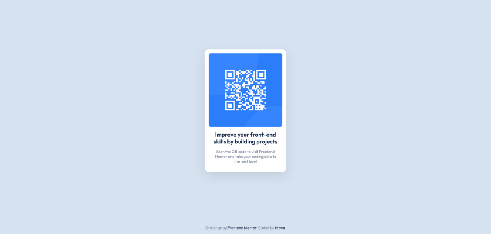

# Frontend Mentor - QR code component solution

This is a solution to the [QR code component challenge on Frontend Mentor](https://www.frontendmentor.io/challenges/qr-code-component-iux_sIO_H). Frontend Mentor challenges help you improve your coding skills by building realistic projects. 

## Table of contents

- [Overview](#overview)
  - [Screenshot](#screenshot)
  - [Links](#links)
- [My process](#my-process)
  - [Built with](#built-with)
  - [What I learned](#what-i-learned)
  - [Continued development](#continued-development)
  - [Useful resources](#useful-resources)
- [Author](#author)

**Note: Delete this note and update the table of contents based on what sections you keep.**

## Overview

### Screenshot



### Links

- Solution URL: [Github Repo.](https://github.com/mzwabantu/qr-code-component)
- Live Site URL: [QR Code Component](https://mzwwwa.co.za/qr-code-component)

## My process

### Built with

- Semantic HTML5 markup
- CSS custom properties
- Flexbox
- CSS Grid


**Note: These are just examples. Delete this note and replace the list above with your own choices**

### What I learned

Flexbox is an amazing css feauture, I position the card to center and middle of the desktop view. CSS Grid I used to put an equal gap between the content of the card. 

Flex card to center of container:

```html
<div class="container">
    <div class="card">...</div>
</div>
```
```css
.container {
    display: flex;
    align-items: center;
    justify-content: center;
}
```

Applying Grid gap to elements:

```html
<div class="card-body">
    <h1>Card Title</h1>
    <p>Lorem ipsum dolor sit...</p>
</div>
```
```css
.card-body {
    display: grid;
    align-content: start;
    gap: 1rem;
}
```


### Continued development

I will look into the newly supported css feautures. Including: ``display: subgrid;`` css grid feauture, ``:has()`` selector, ``@container`` css query.


### Useful resources

- [CSS Grid Tutorial](https://css-tricks.com/snippets/css/complete-guide-grid/) - This is the most comprehensive CSS Grid tutorial, helped me a lot in learning about CSS Grid.
- [CSS Flexbox Tutorial](https://www.freecodecamp.org/news/css-flexbox-complete-guide/) - Freecodecamp is my go to, this is a great resource for learning CSS Flexbox, helped a lot.

## Author

- Website - [Mzwabantu](https://mzwwwa.co.za/)
- Frontend Mentor - [@mzwabantu](https://www.frontendmentor.io/profile/mzwabantu)